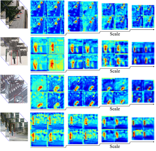
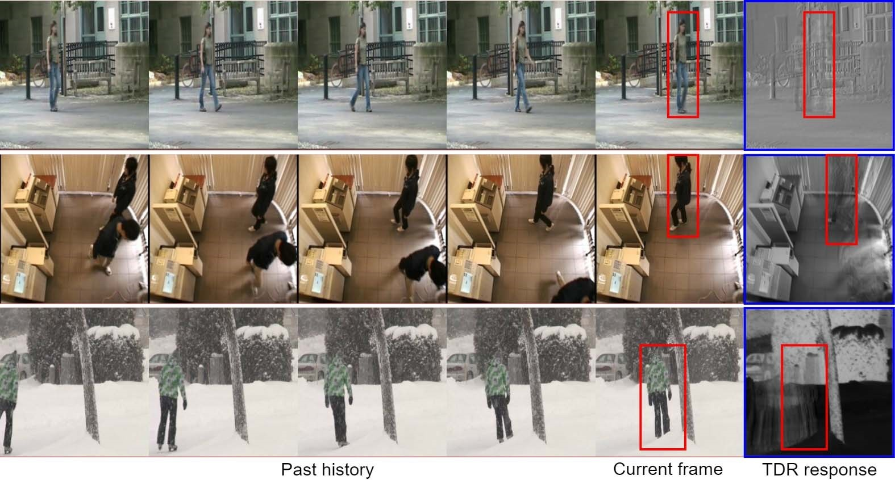
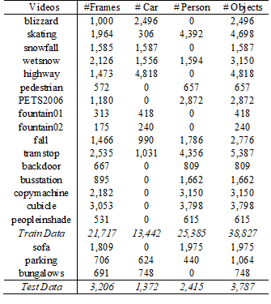
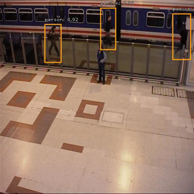

# MotionRec
This repository contains a Keras implementation of the paper 'MotionRec: A Unified Deep Framework for Moving Object Recognition' accepted in WACV 2020. To the best of our knowledge, this is a first attempt for simultaneous localization and classification of moving objects in a video, i.e. moving object recognition (MOR) in a single-stage deep learning framework.

We used the code base of [RetinaNet](https://github.com/fizyr/keras-retinanet) for our work. 


## Description
Due to lack of available benchmark datasets with labelled bounding boxes for MOR, we created a new set of ground truths by annotating 42,614 objects (14,814 cars and 27,800 person) in 24,923 video frames from CDnet 2014 dataset. We selected 16 video sequences having
21,717 frames and 38,827 objects (13,442 cars and 25,385 person) for training. For testing, 3 video sequences with 3,206 frame and 3,787 objects (1,372 cars and 2,415 person) were chosen. We created axis-aligned bounding box annotations for moving object instances in all the
frames.

## Paper
[MotionRec: A Unified Deep Framework for Moving Object Recognition](http://openaccess.thecvf.com/content_WACV_2020/html/Mandal_MotionRec_A_Unified_Deep_Framework_for_Moving_Object_Recognition_WACV_2020_paper.html)

## BibTex
@InProceedings{Mandal_2020_WACV,
author = {Mandal, Murari and Kumar, Lav Kush and Saran, Mahipal Singh and vipparthi, Santosh Kumar},
title = {MotionRec: A Unified Deep Framework for Moving Object Recognition},
booktitle = {The IEEE Winter Conference on Applications of Computer Vision (WACV)},
month = {March},
year = {2020}
}

## [Dataset-Link](https://github.com/murari023/MotionRec)
https://drive.google.com/open?id=16hC3S0Vuz9ZNC2sxI7UuONiBtkA8S_lA

## Installation

1) Clone this repository.
2) Ensure numpy is installed using `pip install numpy --user`
3) In the repository, execute `pip install . --user`.
   Note that due to inconsistencies with how `tensorflow` should be installed,
   this package does not define a dependency on `tensorflow` as it will try to install that (which at least on Arch Linux results in an incorrect installation).
   Please make sure `tensorflow` is installed as per your systems requirements.
4) Run `python setup.py build_ext --inplace` to compile Cython code first.

## Training
MotionRec can be trained using this train.py script. 
Note that the train script uses relative imports since it is inside the keras_retinanet package.

Model can be trained on all csv files in `--csv_path CSV_PATH` folder.
Randomly select a video, read continuous frames (1-10)10 (if depth of history frame is 10) frames, calculate temporal median and TDR block features and perform estimation using resnet 50 and retinanet pyramid. Next choose 11th frame with 10 previous history frames ([1:11] ) and perform estimation.
At end of each video, randomly select new video, start with depth frames.


### CSV datasets
The CSV file with annotations should contain one annotation per line. Images with multiple bounding boxes should use one row per bounding box. Note that indexing for pixel values starts at 0. The expected format of each line is:
```shell
path/to/image.jpg,x1,y1,x2,y2,class_name
```
By default the CSV generator will look for images in csv_folder/train/ directory of the annotations (csv) file.

### Class mapping format

The class name to ID mapping file should contain one mapping per line. Each line should use the following format:
```
class_name,id
```
Indexing for classes starts at 0. Do not include a background class as it is implicit.

### Pretrained models

Model summary can be found in model_summary.md.
**Snapshot and model of trained Motionrec model is attached in snapshots folder.**

### Usage
```shell

keras_retinanet/bin/train.py csv classes.csv

Positional arguments:
  {csv}                 Arguments for csv dataset types.

Optional arguments:     
    --backbone BACKBONE   Backbone model used by retinanet. (default : resnet50) 
                one of the backbones in resnet models (resnet50, resnet101, resnet152)    
    --epochs EPOCHS       Number of epochs to train.     
    --steps STEPS         Number of steps per epoch.        (default: 10000)         
    --lr LR               Learning rate.                    (default: 1e-5)               
    --snapshot-path SNAPSHOT_PATH      
                          Path to store snapshots of models during training    
                          (defaults to './snapshots')    
    --depth DEPTH         Image frame depth.                (default: 10)    
    --initial_epoch INITIAL_EPOCH                           (default: 1)    
                          initial epochs to train.    
    --csv_path CSV_PATH                                     (default: './csv_folder/train/')    
                Path to store csv files for training

```

## Converting a training model to inference model
The training procedure of MotionRec works with training models. These are stripped down versions compared to the inference model and only contains the layers necessary for training (regression and classification values). If you wish to do inference on a model (perform object detection on an image), you need to convert the trained model to an inference model.

### Usage
```shell

keras_retinanet/bin/convert_model.py snapshots/resnet50_csv_60.h5 snapshots/model.h5 

positional arguments:
  model_in              The model to convert.
  model_out             Path to save the converted model to.
optional arguments:
  --backbone BACKBONE   The backbone of the model to convert.
```

## Testing
Use the trained model to test the unseen videos.
Model can be tested on all csv files in --csv_path CSV_PATH. And output is stored in  `--save-path SAVE_PATH` folder.

### Usage

```shell

keras_retinanet/bin/evaluate.py csv classes.csv   snapshots/model.h5

positional arguments:
  {csv}                 Arguments for specific dataset types.
  model                 Path to RetinaNet model.

optional arguments:
  --depth DEPTH         Image frame depth.
  --csv_path CSV_PATH   Path to store csv files for training
              (default: './csv_folder/test/')
  --iou-threshold IOU_THRESHOLD
                        IoU Threshold to count for a positive detection
                        (defaults to 0.5).
  --save-path SAVE_PATH
                        Path for saving images with detections


```

By default the CSV generator will look for images in `visualize/test/` directory of the annotations (csv) file.
Evaluation output is stored in `outputs/FOLDERNAME/`.

## Layer Visualization
MotionRec layer can be visualized using `keras_retinanet/bin/visualize.py`

### Usage

```shell

keras_retinanet/bin/visualize.py csv classes.csv   snapshots/model.h5

positional arguments:
  {csv}                 Arguments for specific dataset types.
  model                 Path to RetinaNet model.

Optional arguments:
  --depth DEPTH           Image frame depth.
  --csv_path CSV_PATH     Path to store csv files for layer visualization
  --save-path SAVE_PATH
                          Path for saving images with visualization
  --layer LAYER           Name of the CNN layer to visualize.
  --layer_size LAYER_SIZE  CNN layer size
   --score-threshold SCORE_THRESHOLD
                        Threshold on score to filter detections with (defaults
                        to 0.05).
  --iou-threshold IOU_THRESHOLD
                        IoU Threshold to count for a positive detection
                        (defaults to 0.5).

```

By default the CSV generator will look for images in `visualize/backdoor/csv/` directory of the annotations (csv) file.
Visualization is stored in `visualize/backdoor/LAYER_NAME/output/`.


## Demo
MotionRec model demo can be executed using `keras_retinanet/bin/demo.py`

### Usage

```shell

keras_retinanet/bin/demo.py csv classes.csv   snapshots/model.h5

positional arguments:
  {csv}                 Arguments for specific dataset types.
  model                 Path to RetinaNet model.
optional arguments
    --depth DEPTH         image frame depth.
  --video-path VIDEO_PATH
                        video name

```

## Results

NOTE: **Snapshot and model of trained Motionrec model can be found in snapshots folder.**

<h4 align="center" style="text-align: center">
  </br>

 Visualization of pyramid levels P3, P4, P5 and P6.
 The relevant  motion  saliencies  of  moving  objects  are  highlighted  using red boxes.
</h4> </br> </br>

<h4 align="center" style="text-align: center;margin: auto;">
  </br>

 Visualization of the TDR background estimation block.
</h4> </br> </br>

<h4 align="center" style="text-align: center">
  </br>

 Summary description of the dataset used in our experiments for training and evaluation.
</h4> </br> </br>

<h4 align="center" style="text-align: center;">
  </br></br>
  </br>
 Qualitative results of our method for unseen video sequences sofa, winterdriveway and parking from CDnet 2014 dataset.
</h4> </br> </br>


## Contributors

Lav Kush Kumar          (lavkushkumarmnit@gmail.com)    
Murari Mandal           (murarimandal.cv@gmail.com)    
Mahipal Singh Saran     (mahipalsaran007@gmail.com)    
Santosh Kumar Vipparthi (skvipparthi@mnit.ac.in)     


## TODO
Realtime demo of MotionRec model.